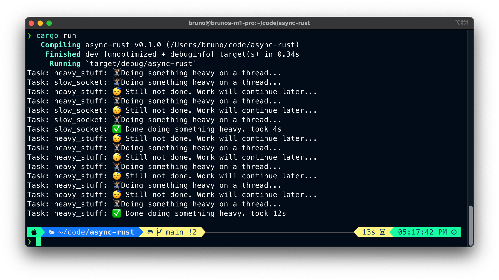

# Rust async executor

Learning along the [Async Rust book](https://rust-lang.github.io/async-book) by building
my own executor to run async code with minimal dependencies.

This is mostly a learning project to understand how Futures work in Rust.

### Run it locally

Execute `cargo run` and a task will be spawned in the custom executor.
To simulate heavy tasks being orchestrated by the custom Executor, I'm adding
some randomness to the time spent within the task threads. You will see a similar output
like in the screenshot below:

